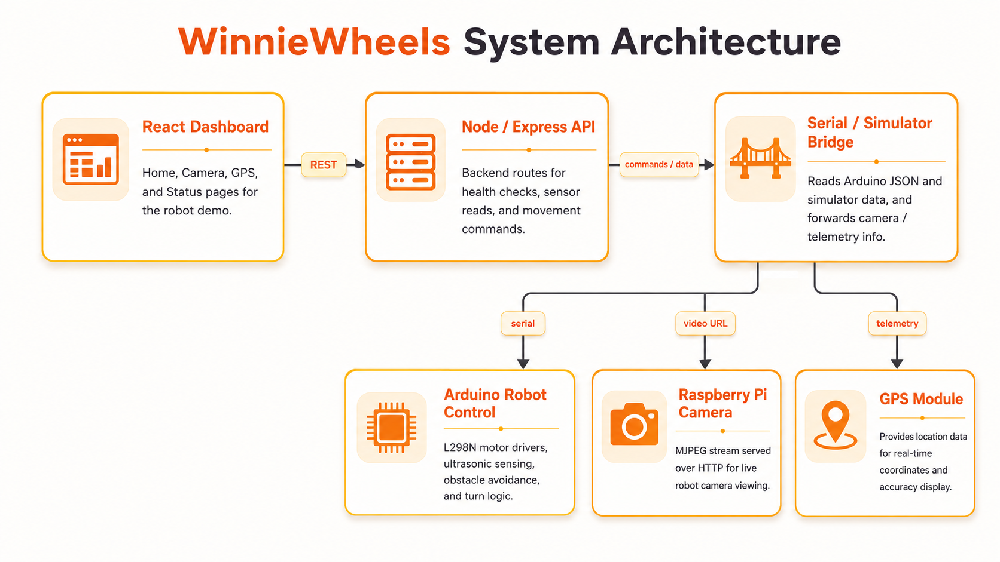
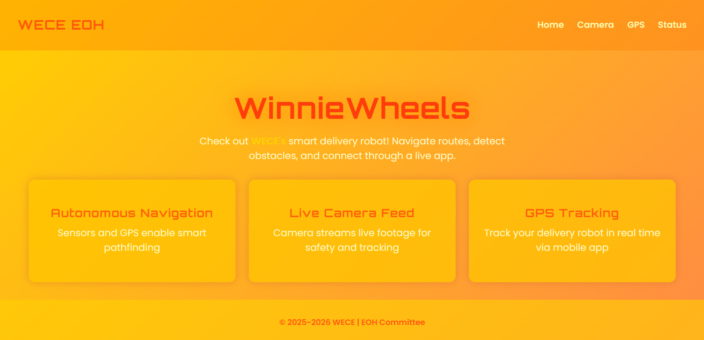
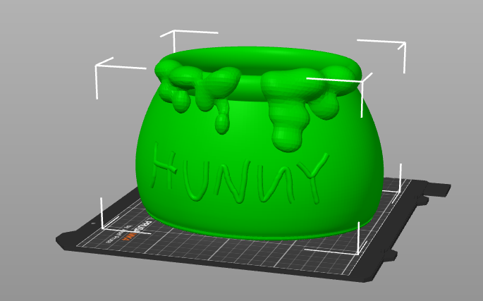

# WinnieWheels

A smart delivery robot demo built for WECE Engineering Open House, combining a React dashboard, Node/Express backend, Raspberry Pi camera stream, GPS/status UI, and Arduino-based obstacle avoidance.

## Overview

WinnieWheels is an autonomous delivery robot project designed to demonstrate hardware/software integration. The system includes a web dashboard for monitoring robot features, backend API routes for sensor and command flow, Raspberry Pi camera streaming support, and Arduino motor-control logic for obstacle avoidance.

## My Role

As WECE EOH Technical Director, I led the project’s technical planning and integration direction. My work included organizing the software and hardware subteams, defining the app structure, coordinating milestones, supporting React/Node/Raspberry Pi/Arduino integration, and helping shape the obstacle-detection demo flow.

## Project Gallery

### System Architecture

The app dashboard communicates with a Node/Express backend, which bridges commands and sensor data between the web app, Arduino robot control, Raspberry Pi camera stream, and GPS/status display.

<p align="center">
  
</p>

### Frontend Dashboard

The React dashboard presents the main demo features: autonomous navigation, live camera feed, GPS tracking, and robot status pages.

<p align="center">
  
</p>

### 3D Print Design

The robot shell was designed around a playful delivery-bot concept and prepared for 3D printing as part of the physical demo build.

<p align="center">
  
</p>

## Tech Stack

| Area | Tools |
| --- | --- |
| Frontend | React, JavaScript, CSS |
| Backend | Node.js, Express |
| Hardware Control | Arduino C++, L298N motor drivers |
| Sensing | Ultrasonic sensors, GPS module planning |
| Camera | Raspberry Pi, MJPEG stream |
| Integration | Serial communication, simulator mode |

## Features

- React dashboard with Home, Camera, GPS, and Status pages
- Live camera page designed for Raspberry Pi MJPEG streaming
- Express API routes for robot health checks, sensor reads, and movement commands
- Simulator mode for testing backend behavior without hardware
- Arduino motor control using front-facing ultrasonic obstacle detection
- Conservative obstacle policy that stops when either front sensor detects an obstacle within the safe range

## Hardware / Control Logic

The Arduino code reads two front-facing ultrasonic sensors. If either sensor detects an obstacle within the safe distance, the robot stops, compares left/right clearance, and turns away from the closer obstacle. When both readings are similar, it defaults to a right turn.

Key parameters in the uploaded firmware:

```cpp
safeDistance = 30.0 cm
forwardSpeed = 100
turnSpeed = 155
rightTurnTime = 650 ms
leftTurnTime = 650 ms
differenceThreshold = 4.0 cm
```

## Repository Structure

```txt
.
├── docs/assets/                 # README images and architecture diagrams
├── robot_control/               # Arduino motion + obstacle avoidance firmware
│   └── robot_control.ino
├── sensor.py                    # Sensor/camera helper script
├── test_cam.py                  # Camera stream test script
└── winniewheels_app/            # React frontend + Express backend
    ├── src/components/          # Home, Camera, GPS, Navbar, Footer
    └── server/src/              # API, serial bridge, simulator, sensor logic
```

## Local Setup

### Frontend

```bash
cd winniewheels_app
npm install
npm start
```

### Backend

```bash
cd winniewheels_app/server
npm install
cp ../../.env.example .env
npm run dev
```

The backend defaults to simulator mode through `MODE=SIM`. For real hardware, update the environment/config values for the Arduino serial port and camera stream URL, then use `MODE=REAL`.
